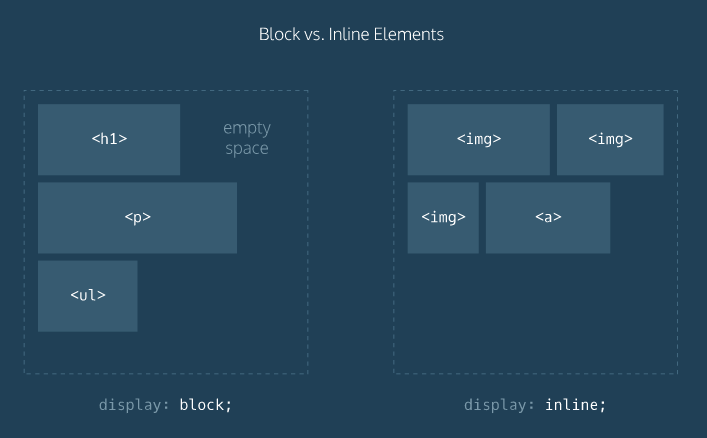
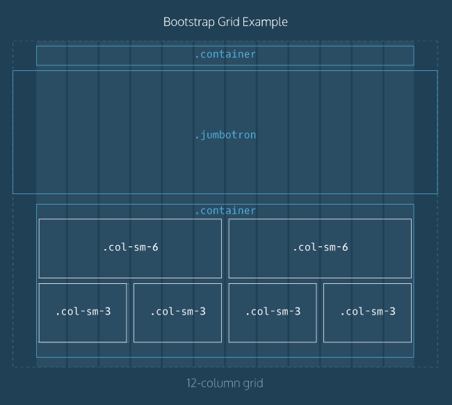

## Make a Website | Codecademy

Build four simple websites using web development fundamentals, including HTML5/CSS3 and Bootstrap.

### Project 1

Site Structure

### Project 2

A Closer Look at CSS

### Project 3

Boundaries and Space

### Project 4

Building with Bootstrap

---

## Deploy a Website | Codecademy

Deploy an static site to the Internet.

1. Generated a static site
2. Deployed it to the Internet
3. Given the website a custom domain name

### Project 5

### Project 6

### Project 7

### Project 8

