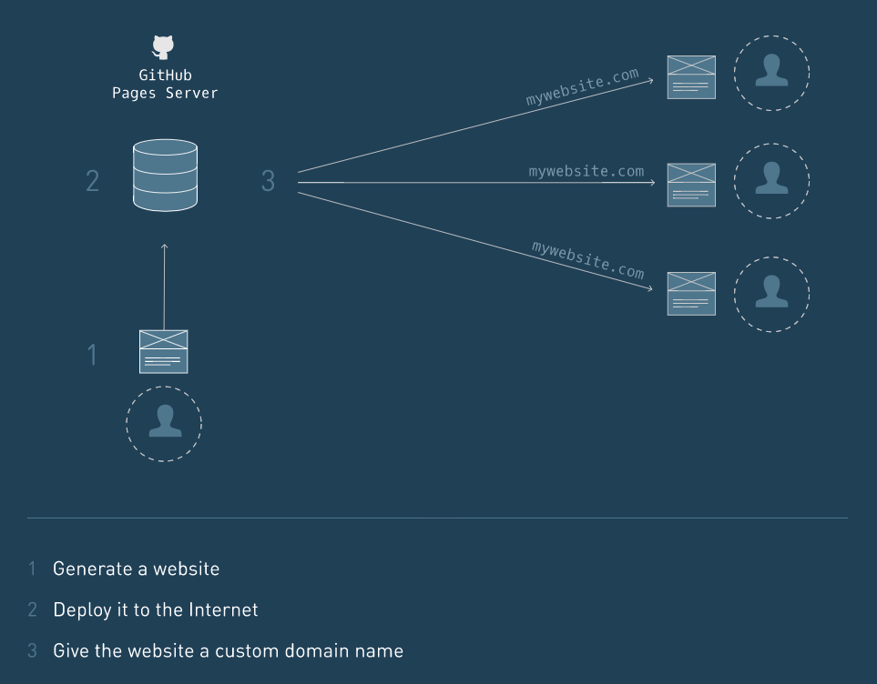
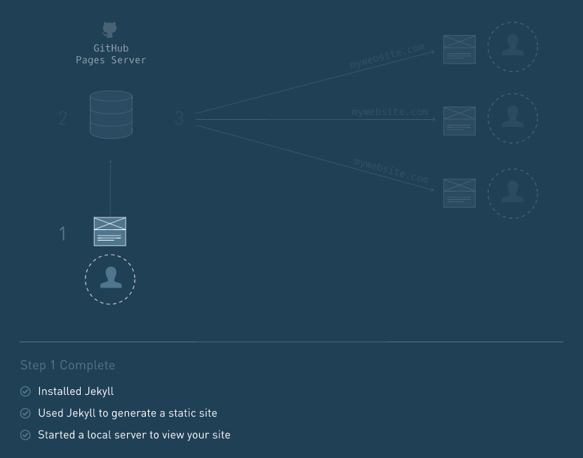

## Make a Website | Codecademy

Build four simple websites using web development fundamentals, including HTML5/CSS3 and Bootstrap.

### [Project 1](https://github.com/meliodaseren/front-end-web-tutorials/tree/master/project_1)

Site Structure

### [Project 2](https://github.com/meliodaseren/front-end-web-tutorials/tree/master/project_2)

A Closer Look at CSS

### [Project 3](https://github.com/meliodaseren/front-end-web-tutorials/tree/master/project_3)

Boundaries and Space

### [Project 4](https://github.com/meliodaseren/front-end-web-tutorials/tree/master/project_4)

Building with Bootstrap

---

## Deploy a Website | Codecademy

Deploy an static site to the Internet.

1. Generated a static site
2. Deployed it to the Internet
3. Given the website a custom domain name

### [Project 5](https://github.com/meliodaseren/front-end-web-tutorials/tree/master/project_5)

* Create a Static Website Using Jekyll

* Deploy Your Website to GitHub Pages

* Assign a Custom Domain Name to Your Website

---

## Learn HTML | Codecademy

[Here](https://github.com/meliodaseren/front-end-web-tutorials/tree/master/HTML_Tutorial)

---

## Learn CSS | Codecademy

---

## Learn Responsive Design | Codecademy

[Here](https://github.com/meliodaseren/front-end-web-tutorials/tree/master/Responsive_Design)

